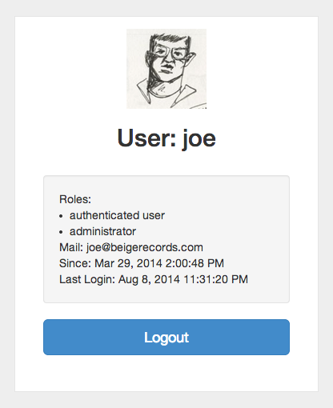

drupal-spa
==========

An example using drupal-client in the browser.

An authenticated session:



### Setup ###

Requires an instance of [Drupal Services](https://www.drupal.org/project/services) 3.5 with all the proper configuration to run the drupal-client tests.

This will tell you whether your Drupal instance is ready to go:

```javascript
npm install drupal-client && cd drupal-client
npm test
```

*Note: You will need to copy test/config.json.example to test/config.json with your server info*

To authenticate to Drupal from AJAX in the browser, you will need to install the [CORS module](https://www.drupal.org/project/cors).

Navigate to `admin/config/services/cors` and configure the CORS module with this domain:

`api/*|<mirror>|*|Content-Type,X-CSRF-Token|true`

... where 'api' is the path to your Services endpoint.

CORS requires the webpage to be loaded with HTTP and not file://, so run a little webserver to test locally:

```
python -m SimpleHTTPServer 9000
```

Then open the SPA at http://localhost:9000

Some basic error messaging is in place:


